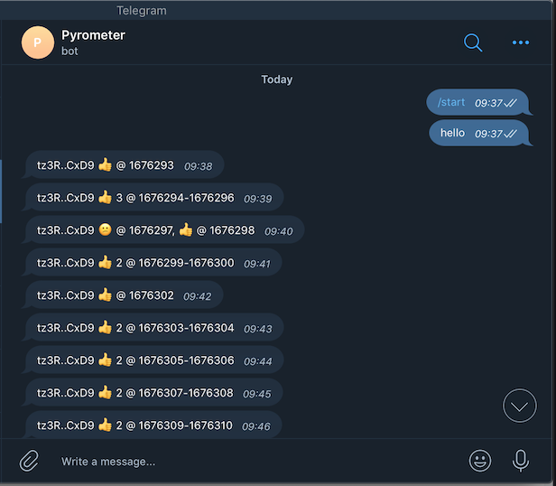

# Overview

Pyrometer is a tool for monitoring events on
[Tezos](https://tezos.com/) networks.

## Design/Architechture

- [Monitoring](./doc/monitoring.md)

## Run on Ubuntu/Debian

- Install NodeJS 16 or later following instructions at
  <https://github.com/nodesource/distributions>.

- Download latest .deb from
  <https://gitlab.com/tezos-kiln/pyrometer/-/releases>

- Install:

``` shell
sudo dpkg -i pyrometer_0.3.0_all.deb
```

- Edit config file at `/etc/pyrometer.toml` to specify bakers and
  nodes to monitor, as well as configure notification channels

- Restart pyrometer service:

``` shell
sudo systemctl restart pyrometer
```

- Check log output, e.g.:

``` shell
journalctl -u pyrometer -f
```

## Run with Docker

Lets define shell alias so that following example commands are concise
and clear:

``` shell
docker network create pyrometer
alias pyrometer="docker run --network pyrometer --rm -v $PWD:$PWD registry.gitlab.com/tezos-kiln/pyrometer"
```

Lets also create a directory for pyrometer configuration and data:

``` shell
mkdir -p ./pyrometer/data
cd pyrometer
```

Generate sample Pyrometer configuration and save it as `pyrometer.toml`:

``` shell
pyrometer config sample > pyrometer.toml
```

> ℹ️ Pyrometer configuration file uses [TOML](https://toml.io) syntax

Edit `pyrometer.toml` as necessary.

For example, lets say we would like to monitor some of the Foundation
Bakers and receive email notifications for all the events except
successful bakes and endorsements.

For illustration purposes we will use
[MailHog](https://github.com/mailhog/MailHog) as our SMTP
server. Start MailHog:

``` shell
docker run --rm --name mailhog --network pyrometer -d -p 8025:8025 mailhog/mailhog
```

MailHog's web interface should now be available at <http://localhost:8025/>

Edit `pyrometer.toml` to look like this:

```toml

exclude = [
  "baked",
  "endorsed",
]

[baker_monitor]
bakers = ["tz3RDC3Jdn4j15J7bBHZd29EUee9gVB1CxD9", "tz3bvNMQ95vfAYtG8193ymshqjSvmxiCUuR5"]
max_catchup_blocks = 120
rpc = "https://mainnet-tezos.giganode.io/"

[log]
level = "debug"

[email]
enabled = true
host = "mailhog"
port = 1025
username = "aaa"
password = "bbb"
to = [ "me@example.org" ]
emoji = true
short_address = true

```

> MailHog accepts any username and password, they just need to be not empty

Now start Pyrometer:

```shell
pyrometer run -c $PWD/pyrometer.toml -d $PWD/data
```

All configuration parameters can be specified or overriden from the
command line. Run `pyrometer --help` to see available commands and
global options, `pyrometer <command> --help` to see command-specific
parameters. Most users will be interested in parameters for `run`:

```shell
pyrometer run --help
```

> ℹ️ Starting with Ithaca protocol, bakers are not punished for missing
> inidividual endorsements. Users may want to turn off notifications
> for missed endorsements (and missed bakes and bonus) and instead rely on
> `baker_unhealthy`/`baker_recovered` pair of
> events. `baker_unhealthy` notification is generated when baker
> misses several endorsements/bakes/bonuses in a row (5 by default), configured via
> `--baker_monitor:missed_threshold`
>

### Run Natively

Install NodeJS 16 or later. For Linux, follow instructions at
<https://github.com/nodesource/distributions>. For other operating
systems, download from <https://nodejs.org>. Configure NPM registry:

```shell
npm config set @tezos-kiln:registry https://gitlab.com/api/v4/packages/npm/
```

Assuming we have `./pyrometer.toml` config file and `./data`
directory, install Pyrometer:

```shell
npm install -g @tezos-kiln/pyrometer
```

Create a config file

```shell
pyrometer config sample > pyrometer.toml
```

and edit as necessary.

Start Pyrometer:

```shell
pyrometer run -c $PWD/pyrometer.toml -d $PWD/data
```

## Docker Build

To build the Docker image from scratch, install
[yarn](https://yarnpkg.com/), clone this repo and run:

```shell
githooks/pre-push
docker build -t tezos-kiln/Pyrometer .
```

### Status UI

Pyrometer provides node and baker status web user interface. To
enable, add or edit `ui` section in the config file:

```toml
[ui]
enabled = true
# port = 2020
# host = "0.0.0.0"
# explorer_url = "https://hangzhou.tzstats.com"
explorer_url = "https://tzstats.com"
show_pyrometer_info = false
```

By default status web page is served on port `2020` at `localhost`.

If running with Docker, be sure to set host to `0.0.0.0` and [publish
port](https://docs.docker.com/config/containers/container-networking/#published-ports)
where web UI is served.

[](doc/pyrometer-0.2.0-ui.png)

Pyrometer UI can be configured to display system resources and
Pyrometer process information by setting `show_pyrometer_info` to
`true`. This is useful when Pyrometer runs on the same machine as
Tezos baker as it allows to quickly asses basic system health
indicators such as availabel memory and disk space.

### Teztnets

Pyrometer provides a shortcut - `--teztnets` option - to enable
monitoring for test network nodes described at
<https://teztnets.xyz/>. For example, to run Pyrometer as a visual
status monitor for testnet nodes using Docker:

``` shell
docker run -p 2020:2020 registry.gitlab.com/tezos-kiln/pyrometer \
    run --ui:enabled --ui:host 0.0.0.0 --teztnets
```

### Notification Channels

Run Pyrometer with `pyrometer run --help` to see the CLI and config
key names for the channel settings.

#### Desktop

Shows desktop notifications (not available when running in Docker)

#### Telegram

Sends notifications via Telegram. To enable:

1. Send `/newbot` to the Telegram BotFather bot and follow the
   instructions to create a bot that Pyrometer will use to send
   notifications. If you've already made a bot, skip to the next
   step. [Start BotFather
   Conversation](https://telegram.me/BotFather).
1. After creating your bot, copy the "HTTP API Token" from the
   BotFather and provide it to Pyrometer either via the CLI or the
   user config file.
1. Click the link to your bot that the BotFather gives you and send
   `/start` to your bot.
1. Start Pyrometer within 24 hours of starting your bot to load the
   `chatId` and complete your setup. If you attempt to complete this
   after 24 hours and the chatId cannot be found, simply send another
   message to your bot and try again.



#### Email

The email notification channel uses SMTP settings that you provide to
send your notifications to an email address. See Pyrometer's help for
the settings. We recommend using
[MailCatcher](https://mailcatcher.me/) or
[MailHog](https://github.com/mailhog/MailHog) to try this out locally while
you're fine-tuning the volume of events you want to receive.

#### Slack

This channel will post your notifications to a Slack webhook. Follow
[the instructions here](https://api.slack.com/messaging/webhooks) to
configure your webhook, and provide the URL to Pyrometer.


#### Webhook

This channel will post the raw JSON of an event to a webhook.  We
recommend this for creating custom apps and visualizations using
Pyrometer's data.
